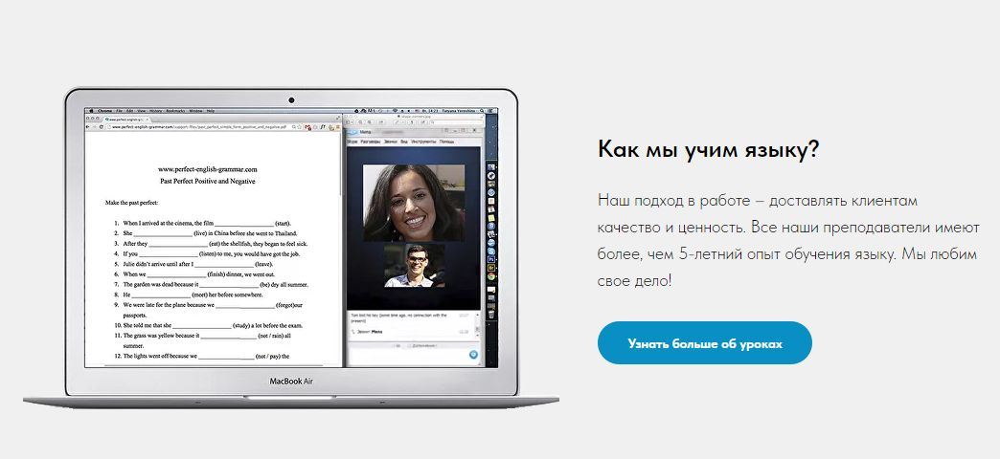
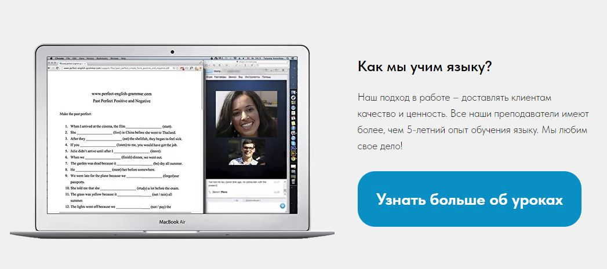
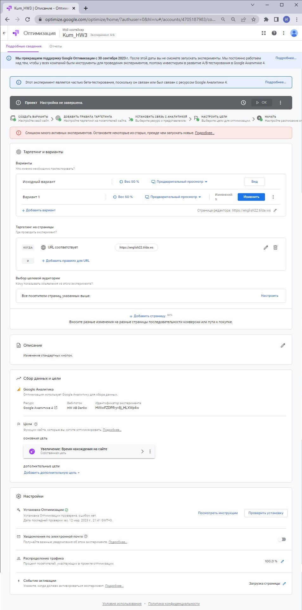

**Шаблон эксперимента + Настроить а/б тест на сайте с 3-мя изменениями http://english22.tilda.ws/**

***Гипотеза***

Изменение кнопок "Попробовать бесплатно" и "Узнать больше об уроках" увеличит время нахождения пользователя на сайте.

***Что делаем***

Контрольная группа без изменений.

Тестовая группа: изменяем кнопки в соответвии с изображениями.

Конрольный вариант:

Тестируемый вариант:

***На каких пользователях тестируем***

Случайным образом делим весь трафик 50 / 50.

***Ключевые метрики для оценки эксперимента***

Время находжения на сайте.

***Ожидаемый эффект***

Увеличение времени нахождения на сайте для тестовой группы.

***План действий в зависимости от результатов***

При подтверждении гипотезы принимается новый макет страницы для всех пользователей.

При отсутвии увеличения времени находжения на сайте, эксперимент завершается, оставляем исходный макет страницы.

**Эксперимент  в Google Optimize:**

Наименование: Kum_HW3

URL: https://optimize.google.com/optimize/home/#/accounts/4705187983/containers/15531172/experiments/444

Скриншот
