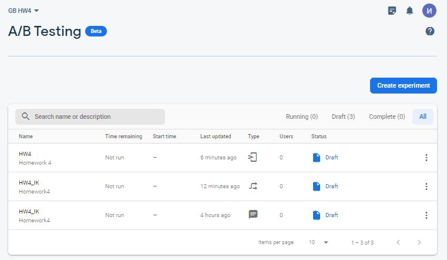
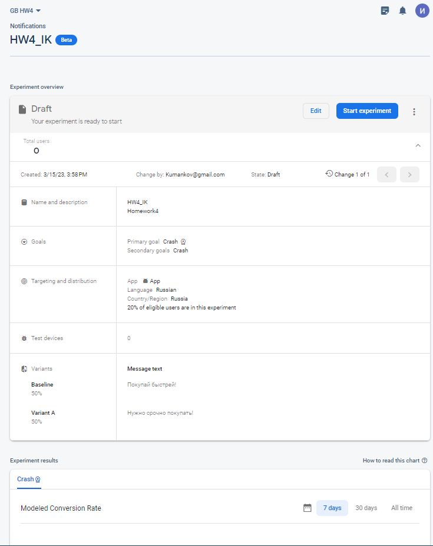
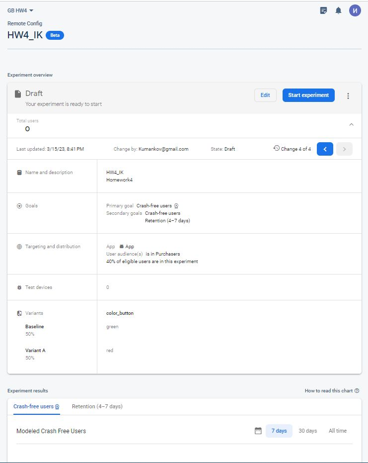
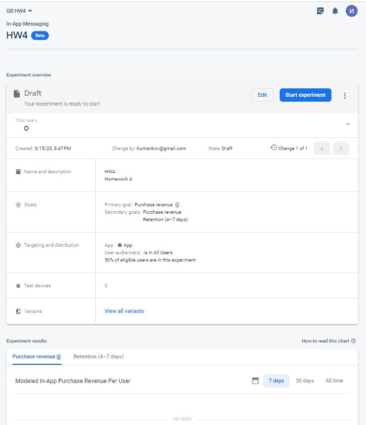
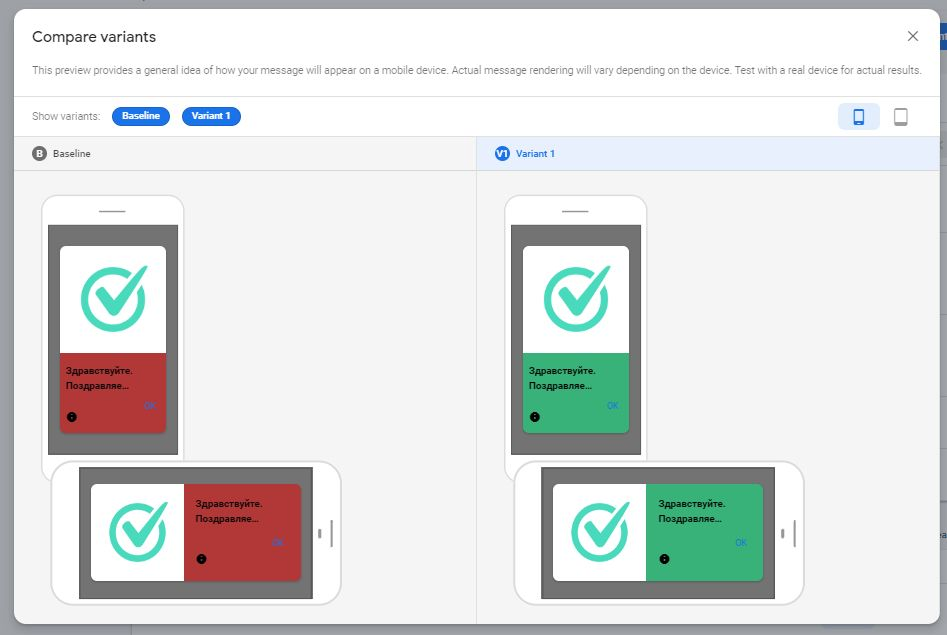

**Настроить а/б тест на сайте с 2-мя изменениями на своем сайте либо на аккаунте преподавателя(доступ по запросу)**

- уведомления
- remote config
- in-app сообщения

**Перечень тестов**

***Уведомления***

***Remote config***

***In-app сообщения***

***in-app сообщения. Варианты.***

