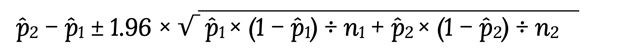

**1)Вы провели эксперимент c упрощением формы заказа в магазине Утконос и получили результаты по метрике конверсий в покупку. Выберите метод оценки и оцените есть ли стат.значимые различия между конверсиями в двух группах при alpha = 5%. Дайте краткие рекомендации команде. Результаты:**

1) Число юзеров в группах  которые заходили на сайт в период эксперимента: n1 = 15550 и n2 = 15550. 

2) Число юзеров в группах , которые совершили хотя бы одну покупку за период эксперимента: n1 = 164 и n2 = 228 

3) Конверсии : conv1 = 1.05% conv2 = 1.47%.

**2) Сравниваем метрику конверсия в покупку. Размер выборки - 10000 элементов в каждой группе . Какой статистический критерий тут лучше всего подойдёт и почему ?**

***Задание 1***

Необходимо определить есть ли статистически значимая разница между группами с достоверностью 95% (1-alpha):

Пусть p̂1 = conv1 и p̂2 = conv2 посчитанные в A/Б-тесте конверсии, в контроле p̂1 = 1.05%, а в тесте p̂2 = 1.47%.
n1 и n2 — количество посетителей в каждой из них. n1 = 15550 и n2 = 15550.
Посчитаем доверительный интервал по формуле:

0.0147 - 0.0105 - 1.96 * (0.0105 * (1 -  0.0105) / 15550 + 0.0147 * (1 - 0.00147) / 15550)**1/2 = [0.004198420142882314 ; 0.004201579857117684]

***Так как 0 не входит в интервал в доверительный интервал, то между группами есть статистически значимая разница. А поскольку доверительный интервал больше 0, то гипоза работает и упрощение формы заказа увеличивавет конверсию.***

***Задание 2***

Поскольку по условиям задачи не дано значение стандартного отклонения генеральной выборки, то считаем, что оно неизвестно. Также мы полагаем, что необходимо сравнить 2 группы, следовательно необходимо использовать t-критерий Стьюдента. 

Если групп больше двух то можно проводить попарное сравнение для определения наличия статистически значимых различий.
