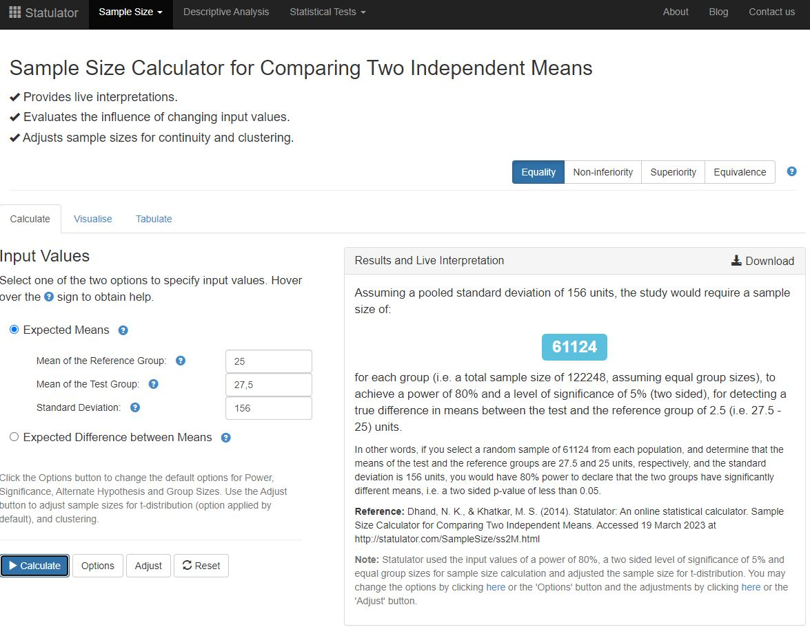
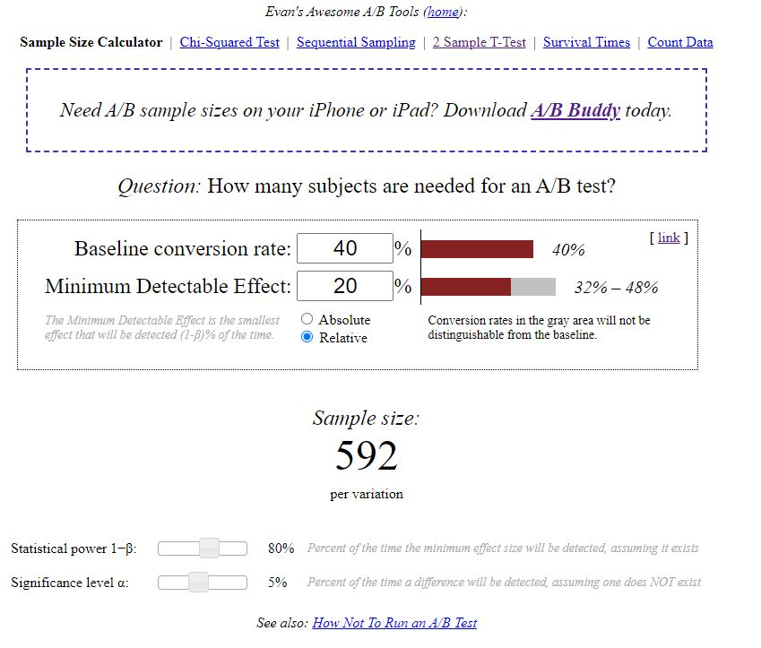

**Задание 1**

Продакт на главной mail.ru решил протестировать в рекомендательной ленте контента вместо карточек со статьями видеоплеер с короткими видео. Нынешний таймспент на юзера в день в среднем равен 25 минут, а стандартная ошибка (SD) равна 156. Мы предполагаем, что в новой версии таймспент на юзера в день изменится на 10%. Средний трафик 20000 человек в день. Посчитайте сколько дней необходимо держать эксперимент при alpha = 5% и beta = 20% .

**Задание 2**

Наша продуктовая команда в ecommerce магазине планирует запустить тест, направленный на ускорение загрузки сайта. Одна из основных метрик bounce rate в GA = 40%. Мы предполагаем, что при оптимизации сайта она изменится минимум на 20%.Средний трафик 4000 человек в день. Посчитайте сколько нам нужно дней держать эксперимент при alpha = 5% и beta = 20%

***Задание 1***

Чтобы узнать необходимую длительность экперимента необходимо определить размер выборок в группах A и B.

Воспользуемся калькулятором:

Таким образом общий размер выборки для двух групп - 122 248.

При среднем трафике 20 000 человек в день эксперимент необходимо продолжать 7 дней. 

122 248 / 20 000 = 6.1124

***Задание 2***

Аналогично заданию 1 необходимо определеить размеры выборок. Поскольку стандартная ошибка неизвестна, воспользуемся другим калькулятором.

Общий размер выборки для двух групп - 1 184.

При среднем трафике 4 000 человек в день эксперимент необходимо продолжать 1 день. 

1 184 / 4 000 = 0.296